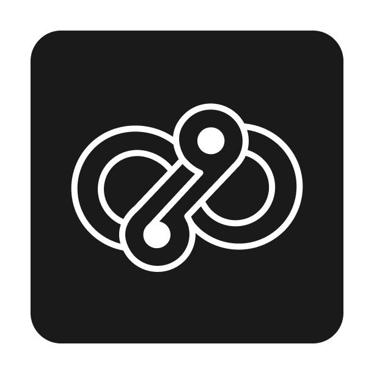
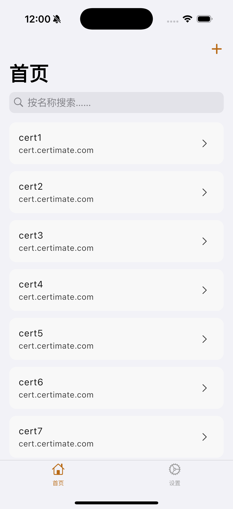
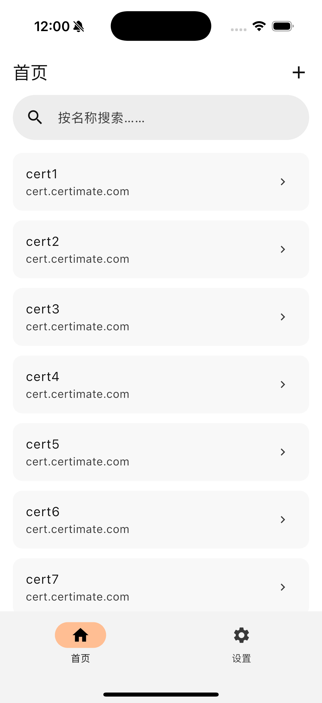
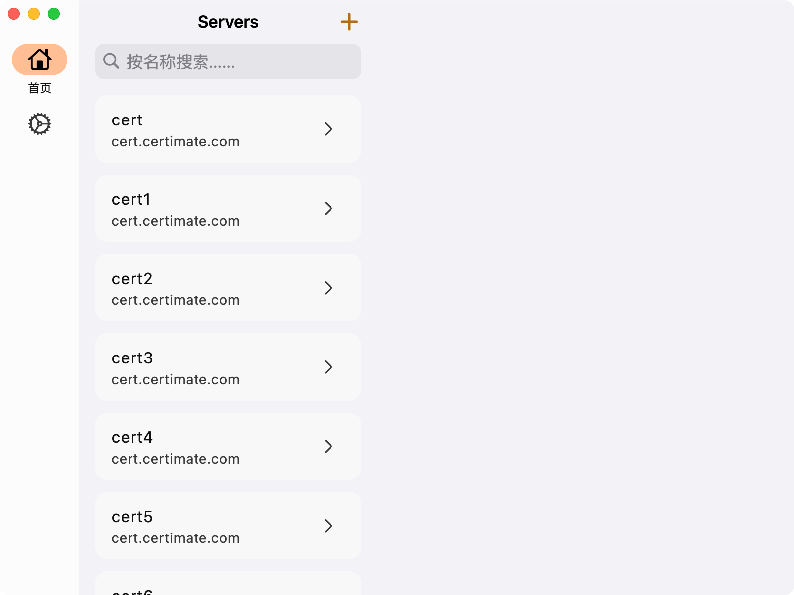
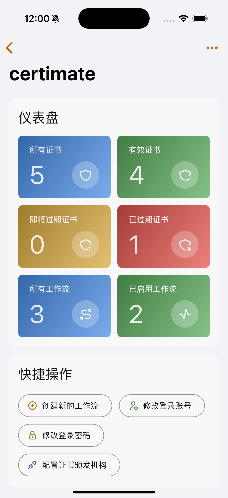
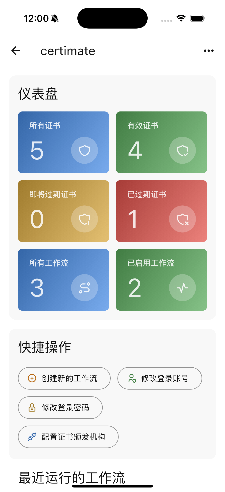
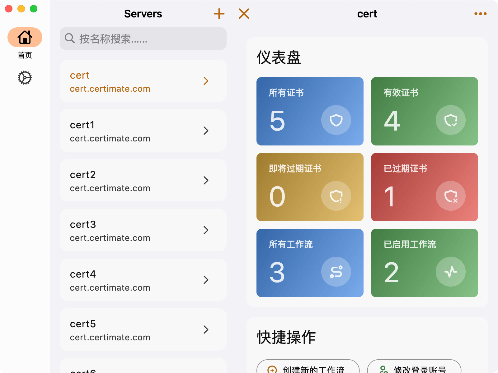
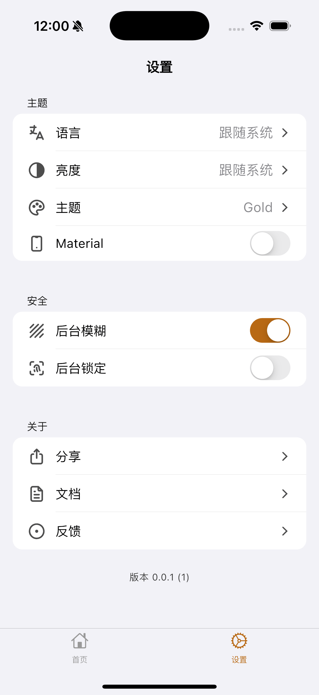
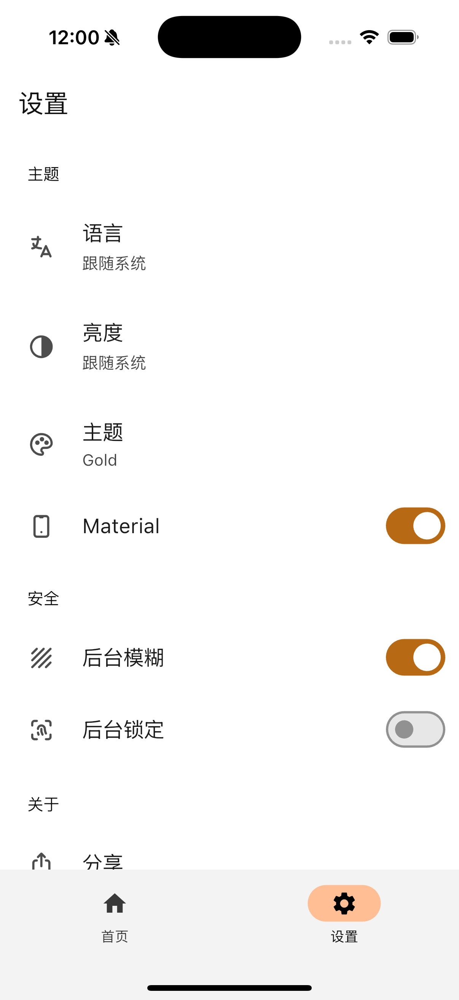
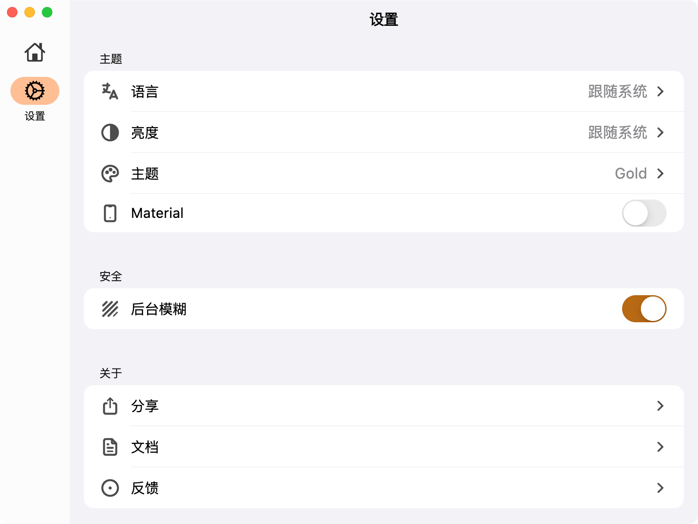

<div align="center">



<h1>Certimate Flutter</h1>

[](https://opensource.org/license/agpl-v3)
[](https://github.com/belier-cn/certimate_flutter/releases)


本项目是 [Certimate](https://github.com/certimate-go/certimate) 的跨平台客户端，可便捷地管理多个 Certimate 服务。

</div>

## ✨ 功能简介

- 支持同时接入多个 Certimate 服务
- 支持本机 Certimate 服务管理（启动/停止/重启/升级）
- 内置自动刷新 token 机制，无需频繁手动登录
- 密码存储于系统安全区域，保障账户安全
- 提供应用锁定功能，进一步提升隐私安全
- 支持多语言国际化，使用更便捷
- 支持暗黑模式，夜间使用更舒适
- 提供多套丰富主题，个性化定制界面
- 可自由切换 Material、Cupertino 风格 UI

## ⭐ 运行界面

[在线预览](https://belier-cn.github.io/certimate_flutter)

| iOS                                                          | Android                                                          | Desktop                                                          |
|--------------------------------------------------------------|------------------------------------------------------------------|------------------------------------------------------------------|
|      |      |      |
|    |    |    |
|  |  |  |

## 💿 支持平台

| 平台            | 支持版本   |
|---------------|--------|
| **iOS**       | 13.0+  |
| **Android**   | 7.0+   |
| **HarmonyOS** | 5.0+   |
| **macOS**     | 10.15+ |
| **Windows**   | 10.0+  |
| **Debian**    | 10.0+  |
| **Ubuntu**    | 20.04+ |

> Linux 暂未实现 WebView，目前无法访问网页。

> ~~HarmonyOS 打包后闪退，需等待相关 [PR](https://gitcode.com/openharmony-sig/fluttertpc_dart_sdk/pull/18) 合并。~~

## ⏬ 下载地址

可以通过右侧 [Releases](https://github.com/belier-cn/certimate_flutter/releases) 进行下载

> 如果在 macOS 上安装后无法打开，报错**不受信任**或者**移到垃圾箱**，执行下面命令后再启动
> ``` shell
>  sudo xattr -d com.apple.quarantine /Applications/Certimate.app
> ```

> 如果在 Windows 上打开某些页面闪退，请尝试更新 Microsoft Visual C++ 到最新版本
>
> 下载地址：https://learn.microsoft.com/en-us/cpp/windows/latest-supported-vc-redist?view=msvc-170

## 🤝 参与贡献

- 欢迎提交 Issue / PR 或参与协作开发。
- 有任何功能建议或 bug，可以直接在 [Issues](https://github.com/belier-cn/certimate_flutter/issues) 提交。

## ⛔ 免责声明

本项目遵循 [AGPL-3.0 License](https://opensource.org/license/agpl-v3) 开源协议，应用完全免费，请在官方渠道下载使用。

- 项目开发者对因使用本软件所产生的任何数据丢失、信息泄露、服务中断或其他直接、间接损失不承担任何责任。
- 用户需自行负责账号与证书等敏感信息的安全配置与保管。
- 对于因本项目代码或其依赖库可能存在的漏洞所导致的风险，开发者不承担任何法律责任。
- 请在使用和发布前，仔细阅读项目源码和相关文档，自行评估风险并承担使用本项目的一切后果。
